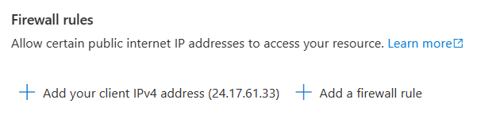
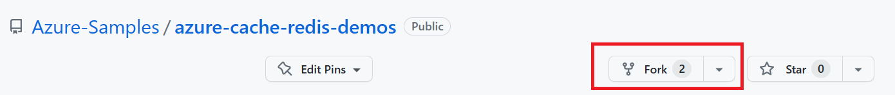
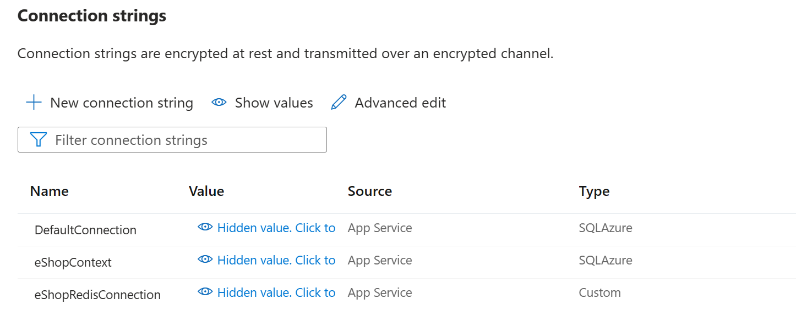
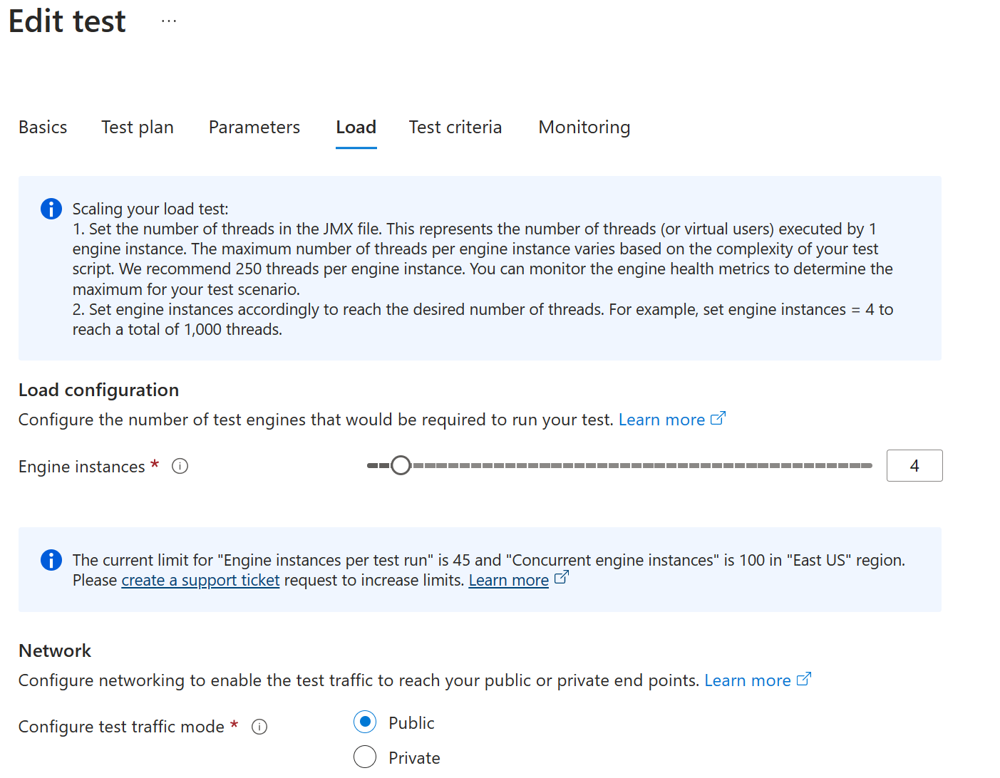
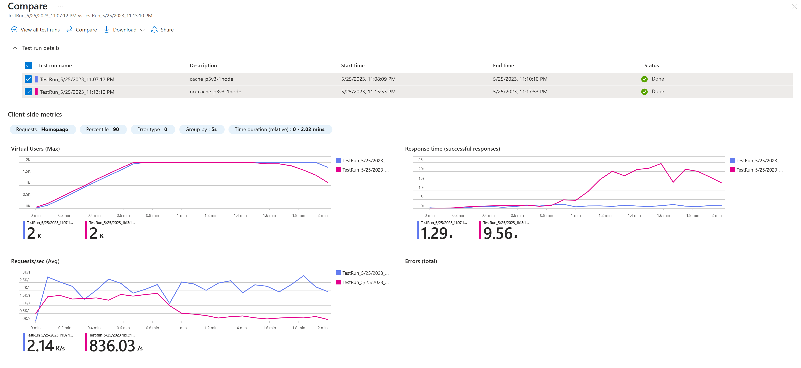

# eShop

An online shopping Web App in ASP.NET core to showcase Azure Cache for Redis by implementing cache-aside pattern, session store, and data store using it. 

## Features

This project framework provides the following features:

* Using cache for cache-aside pattern on product list to accelerate databases performance
* Distributed Cache tag helper on .cshtml to save CPU used in rendering view.
* Using cache as session store on last view item and shopping time
* Using cache as data-store for shopping cart
* User management:
    - Individual User authentication
    - RBAC authorization

## Getting Started

### Prerequisites

- .NET 7, ASP.NET core 7 or above

### Installation

- Create an Azure Redis Cache and obtain the connection string. [Instruction](https://learn.microsoft.com/azure/azure-cache-for-redis/quickstart-create-redis)

### Quickstart - running the project locally with an instance of Azure Cache for Redis in your Azure subscription

1. Obtain the sample code.
    * Download zip. Extract the .zip file
    * or "git clone https://github.com/Azure-Samples/azure-cache-redis-demos.git" in Git command interface. Install Git if needed: [Git Downloads](https://git-scm.com/downloads)
2. Open a command line interface. Change to the project directory that contains the .csproj file: 
    * cd <Path_to_downloaded_code>/eShop/eShop
3. Initialize user secrets for development environment:
```
    dotnet user-secrets init
```
4. Obtain an instance of Azure Cache for Redis: [Quickstart: Create an open-source Redis cache](https://learn.microsoft.com/azure/azure-cache-for-redis/quickstart-create-redis)
5. Save Redis Cache connection string to User Secrets:
``` 
dotnet user-secrets set "ConnectionStrings:eShopRedisConnection" "your_cache_connectionstring"
```
6. Entity Framework migration to create database tables for user, products, and shopping cart items:
``` 
    dotnet ef migrations add <enter_a_name_for_Migration> --context eShopContext
    dotnet ef migrations add <enter_a_name_for_Migration> --context ApplicationDbContext
    dotnet ef database update --context eShopContext
    dotnet ef database update --context ApplicationDbContext
```
8. BUild and run the web application
```
    dotnet build
    set ASPNETCORE_ENVIRONMENT=Development
    dotnet run
```

9. Next step,  follow the **Deploy the proejct to Azure** section below to run your web application in the Cloud.

## Deploy the project to Azure
1. **Create Azure Resources** 

    Create Azure Web App, Azure SQL database, and Azure Cache for Redis instance from https://aka.ms/redis-cache/webapptemplate. Select 'Yes' to add Azure Cache for Redis.
    

2. **Configure SQL Server firewall rules**
    
    Add firewall rule to the database for running entity framework migrations. Navigate to the SQL server in Azure portal. Click the Networking tab. Under firewall rules click **+ Add your client IPv4 address**. This is a one time effort and the rule can be removed after use. 
    

3. **Fork the Sample Repository**

    You may have obtained the sample code when running locally. But for securely and successfully deploying the app to Azure, you need to fork the sample into your own Github account so the Github actions can be configured for a secure deployment process.

    
    
4. **Add user secrets for database connection strings**

    Initialize dotnet user-secrets if you have not yet:
    ```
    dotnet user-secrets init
    ```

    Obtain database connection string from Azure Portal, Web App Configurations page | Connection Strings section. The Azure Marketplace quick start deployment automatically added the connection string with name **AZURE_SQL_CONNECTIONSTRING**. Edit to copy the value

    Run the following commands to add user secrets:
    ```
    dotnet user-secrets add "ConnectionStrings:DefaultConnection" "your_connection_string"

    dotnet user-secrets add "ConnectionStrings:eShopContext" "your_connection_string"
    ```

5. **Run Entity Framework Migrations to create database tables**

    Open a command prompt. Change to the eShop project folder directory with the .csproj file. Run the following commands.
    ``` 
    dotnet ef migrations add <enter_a_name_for_Migration> --context eShopContext
    dotnet ef migrations add <enter_a_name_for_Migration> --context ApplicationDbContext
    dotnet ef database update --context eShopContext
    dotnet ef database update --context ApplicationDbContext
    ```

    After these steps, you can delete the firewall rule on the Azure SQL Server fo security best practices. 

6. **Edit the Github workflow file to deploy the project to Azure**

    Open the .github/workflows folder. In the last action **deploy-to-webapp** section, there is an **app-name** property. Change it to the name of your web app, less the domain.

    

7. **Add AAD credential in the Repository secrets**

    Follow instructions at [Use the Azure login action with a service principal secret](https://learn.microsoft.com/azure/developer/github/connect-from-azure?tabs=azure-portal%2Cwindows#use-the-azure-login-action-with-a-service-principal-secret) to:
    * create a service principal that access access to your resource group
    * add a secret in your git repository for the workflow file to login and deploy code to your resources

    

8. **Trigger workflow file to deploy the project to Azure**

    Check in the changes to the workflow file. The workflow file will be triggered to deploy the code to your Web App.

9. **Configure environment variables in the Web App Configuration**

    Go to the your Web App in Azure Portal. Browse to **Configuration | ConnectionStrings** section. The quick start deployment template generated AZURE_SQL_CONNECTIONSTRING and AZURE_CACHE_CONNECTIONSTRING settings. Recreate to match what we used in the project code:
    
    * DefaultConnection: <your_Azure_SQL_ConnectionString>
    * eShopContext: <your_Azure_SQL_ConnectionString>
    * eShopRedisConnection: <your_Azure_Cache_ConnectionString>

    The Connection Strings section should contain the following once done:

    

10. **Browse to your web app to try the features**
    
    Next step, follow the Demo section below to try out the web app. If you want to jump directly to view the performance, go to Load test the web application performance section directly.


## Demo

A demo app is included to show how to use the project.

To run the demo, follow these steps:

1. Launch web app in browse. It will be connected to the local databases and an Azure Cache for Redis instance

    

2. Navgiate to /Products route, sign in with the following credential:
    *  admin@eshop.com
    *  Admin@12345
3. Add products to the product list. There are already products added from database seeding
4. Sign-out
5. View an item, add to shopping cart, continue to shop, check out, etc. 
6. (Optional) Create a new user and sign-in to browse the site.
7. Next step, load test the web application performance

## Load test the web application performance
We will mimic 2000 concurrent users sending request to the web app home page for 2 minutes. given 1/3 of total users are active any a given time, this means your web application has ~6000 users in total.

The load test is run using configurations optimized for this particular web app scenario. Consider your own scenarios by the following factors:
    * Number of concurrent users your web app will have
    * Performance target. i.e. <500ms response time
    * Load pattern. i.e. users will browse the app within the first 30 min starting 11am for ordering lunch, or users will be online all at once at 12am for getting game tickets, etc.
    * Plan your hardware configuration. Refer to [Performance testing on various Azure Cache for Redis SKUs](https://learn.microsoft.com/azure/azure-cache-for-redis/cache-best-practices-performance)

The rest of content in this section walks through the process load testing our sample application with assumptions on how the app will work.

1. **Setup Azure Load Test service**

    Follow instructions at [Quickstart: Create and run a load test with Azure Load Testing](https://learn.microsoft.com/azure/load-testing/quickstart-create-and-run-load-test?tabs=virtual-users) to create a quick load test. 
    
        * Use your web app domain to the destination of **Test URL** on the **Quickstart test** page.
        * put 40 seconds for the ramp up time
        * put 120 seconds for test duration
        * put 500 threads per engine to mimic 500 users from each node
        * put 4 instances of engines
    
    Refer to the screenshots below on the configured load test.

    

    

2. **Upload pictures to a storage account**
    
    For the convenience of having something working right away after deployment, the sample code put all images under the wwwroot/ folder. This is not scalable in real scenarios. The best practice is to upload the images to an Azure Storage Account blob.

    * Create an Azure Storage Account by following instructions at [Create a storage account](https://learn.microsoft.com/azure/storage/common/storage-account-create?tabs=azure-portal)

    * Download [Azure Storage Explorer](https://azure.microsoft.com/products/storage/storage-explorer/). Click the **Operating system** button to download. After installation finishes, sign-in to Azure and connect to your Storage account.
    


    * Create a new blob in the storage acount.
    
    * Go to the wwwroot/images folder. Upload the images to the newly created blob storage. 

    * Go to Azure portal, browse to your Storage Account. Configure the blob access to be public.

    

3. **Use the blob URI endpoint for displaying the pictures**
    Instead of using the pictures under wwwroot/ folder, we will change the Product items to use the uploaded pictures in the storage blob container.

    * Browse to your web app, /Products route
    * Login with the admin credential:
        * admin@eshop.com
        * Admin@12345 (this is hardcoded in the program.cs file)
    * Edit each product and change the image URI to the blob endpoint.You can obtain the blob endpoint URI in Azure Storage Explorer, right click on a blob and copy URL.

    

4. Scale up the App Service Plan to P3V3, 1 node to handle 2000 concurrent users. The point is the web app won't get throttled by CPU.

    

5. **Run load service in Azure portal**
    Go back to Azure portal, browse to the load test you configured earlier. Click into your test.
    Run test by clicking the Run button. Optionally put a description. 

6. **View load test result**
    If you repeat the process using no-cache branch, you will be able to obtain two load test results. Comparing side-by-side. The performance for web application using Redis Cache is presented by the blue line, and the web application without Redis Cache is presented by the red line. Results show that the 90th percentile response times are 1.29s (cache) vs. 9.56s (no-cache), and the throughputs are 2.14k/s (cache) vs. 837/s (no-cache). 

    


## Resources

- AzureCache@microsoft.com for questions and feedback
- For guidance on how to implement patterns and best practices using more Azure services, refer to [Reliable web app pattern for .NET - Apply the pattern](https://learn.microsoft.com/azure/architecture/reference-architectures/reliable-web-app/dotnet/apply-pattern)