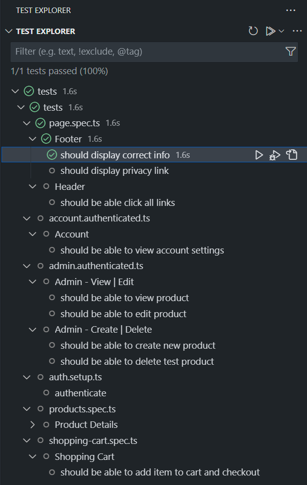

# Playwright Tests

## Prerequisites

* [Node](https://nodejs.org/dist/v18.15.0/)
* [VS Code](https://code.visualstudio.com/download)

## Resources

* Docs:  <https://playwright.dev>

* GitHub: <https://github.com/microsoft/playwright>

* Discord: <https://aka.ms/playwright/discord>

## Installing VSCode Extension

You can install the Playwright extension for VSCode from the marketplace ([LINK](https://marketplace.visualstudio.com/items?itemName=ms-playwright.playwright)). This extension will help you get started with Playwright quickly. It will also help you run and debug your tests from within VSCode.

The Playwright docs have more details here: [Using the Playwright VSCode Extension](https://playwright.dev/docs/getting-started-vscode)

## Running tests in VSCode

1. Restore project dependencies:
   * Open a cmd window and navigate to the `eShop/tests` folder.
   * Run `npm install`.

1. This project uses a `.env` file to easily manage environment variables. Open `eShop/tests/.env` and set the following environment variables. NOTE: This file is gitignore'd. Do NOT check in these changes to source control!:

    ```bash
    # URL of web app   
    BASEURL = ''
    # Credentials of test user    
    TESTUSERNAME = '' 
    TESTPASSWORD = ''
    ```

1. Click on the `Testing` tab in VSCode's activity bar. This will show you all the tests in the project (in a tree structure).

    

1. You can run a single test (or a group of tests) by clicking the triangle symbol next to it. When Playwright finishes executing the test(s), you will see a green tick next to your test block as well as the time it took to run the test.

1. You can navigate to the test code by right-clicking on the test name in the tree structure, selecting `Go To Test`.

## Debugging the tests

1. You can set breakpoints in your test code by clicking on the left "gutter" (the left-most column in the code editor). Right-clicking in the gutter will show you more options (like setting a conditional breakpoint).

1. Then you can run a test in debug mode by clicking on the `Debug` button next to the test name in the tree structure.

1. Once the breakpoint is hit, you can use the single-step through the code and inspect variables (Note: These debugging features are already built into VSCode, and aren't playwright specific. [More details](https://code.visualstudio.com/docs/editor/debugging)).
